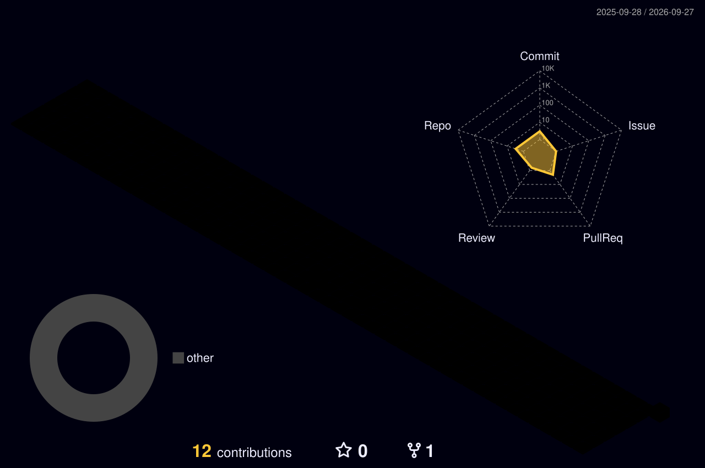

  

### Hi, I'm Pratham

I'm a software engineer with ~2 years of experience in **Java, Spring Boot, and distributed systems**.

I'm actively learning system design (scale, reliability, trade-offs), the kind of problems I genuinely enjoy thinking about. I'm also curious about how AI is changing the way engineers work and ship software.

**Right now**

- Going deeper on system design and distributed systems
- Using coding agents like Claude Code to plan, write, review, and ship code
- Thinking about how system design changes when parts of a pipeline are non-deterministic

 

  

 

  
  

  

